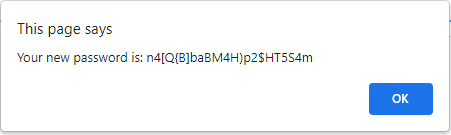

# Password Generator Starter Code

## Purpose
A website that creates a strong password that gives great security.  Asks user how many characters in the password through a prompt.  Website receives answer and verifies if it has the correct number of characters.  The user then receives prompts asking if they want lowercase characters, uppercase characters, numeric characters and special characters.  The website confirms what character types the user chose and verifies that at least one character type is selected.  The password is then generated and displayed in alert and returned to the text box on the page.  

## Built With
* JavaScript
* CSS and HTML given

## Website
https://ajmarrocco.github.io/ajm-password-generator/

## Contribution
Made by Anthony Marrocco

## Images with Descriptions

### Home Page

 

### Asks user how many characters password should have

### If you respond with correct amount of characters

### If you respond with incorrect number of characters

### Asks user what character types they want

### If the response is "YES"

### If the response is "NO"

### If the response is null or neither yes or no

### If there is no character types at all

### Password is generated, you get an alert

### Asks if you are satisfied with password

### If yes

### If no

### Password in text box

### &copy; Anthony Marrocco